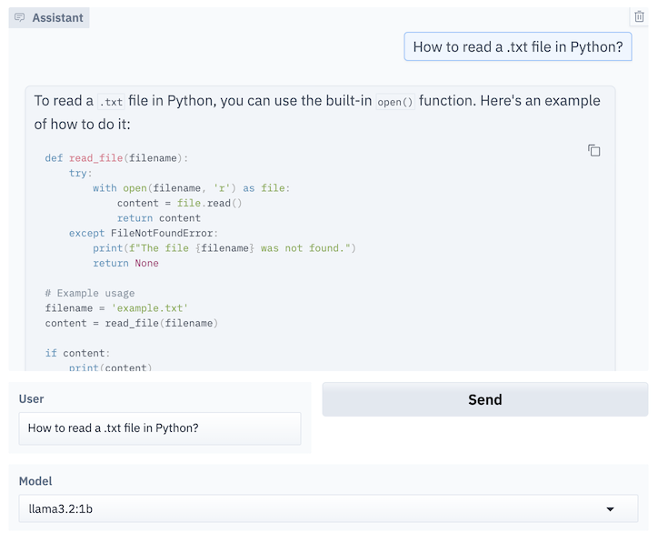

# chatty-bot

AI conversational assistants running locally on your machine.

## Installation

1. Install Ollama: https://github.com/ollama/ollama

2. Clone the repository:
```bash
git clone https://github.com/pme0/chatty-bot.git
cd chatty-bot
```

3. Install dependencies:
```bash
pip install gradio ollama
```


## Usage

1. Initialise Ollama:
```bash
ollama serve
```

2. Start the applications:
```bash
./chat
```

This will give you a URL `http://http://0.0.0.0:5555`, click it to open the application on the browser.



